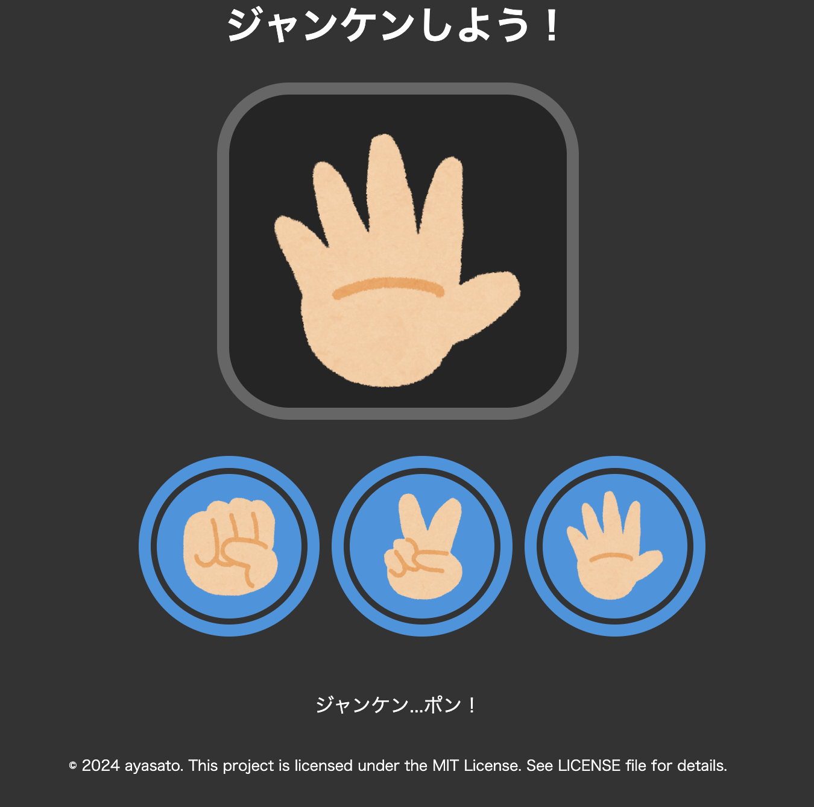

# ①課題番号-プロダクト名
じゃんけんアプリ

## ②課題内容（どんな作品か）

- ランダムで作った整数を使って、じゃんけん遊びができます。
- たまに変なのが出てきます。

## ③DEMO

デプロイしている場合はURLを記入（任意）

## ⑤工夫した点・こだわった点

- 小さい頃近所のスーパーにあったジャンケンゲーム機を簡易的に再現
- ボタンのhoverでキランと光る仕様にしました
- 小学生がたまにやる「ジャンケン全部だし」を1/10の確率で出したかったが、イメージに適した画像がイラスト屋さんになかったので、ビックボスの手（アロハで検索）がたまに出てくる仕様にしました。
- 画面がスクロールしないようにCSSで見切れるための処理をしています
- 息子に実際に遊んでもらって、直感的に使えるか確認しました。
- ルーレットみたいに画像がパラパラ変わる仕様が、昔のゲーム機のイメージに近くて満足です。opacityで表示を切り替えました。

## ⑥難しかった点・次回トライしたいこと(又は機能)

- 画像がダブって表示されるバグの原因がわからず悩んだ
- 原因は「ボタンを止めた瞬間の画像」と「PCが選んだジャンケンの手の画像」が別々に表示されてしまったため起きていた
- 結果として、「ボタンを止めた瞬間の画像」が表示されないように、ボタンを止めたら一旦全ての画像を非表示にすることで解消
- 次は勝った後にコインがもらえるルーレットも実装したい。より一層、思い出の機械を再現できそう
- 子供用にAI音声をつけるのもやりたい。思い出のゲーム機は音声が特徴的でよく真似していたので、そのまま再現したい。負けたら「ズコー！」勝ったら「ヤッピー！」って言ってコインルーレットが始まる仕様だった。あの昭和から平成初期っぽさを再現したい。
- 子供達はリトライするときにどのボタンを押したらいいのか迷ったので、リトライボタン自体も追加したい（現状はボタンをもう一度押せば動く）

## ⑦質問・疑問・感想、シェアしたいこと等なんでも

- [質問]if文を入れ子にして書いていますが、もっと挙動が早くなる方法はありますか？もしくは分かりやすく関数を分けていきたい。
- [感想]簡単そうに見えて難しかったです。
- [参考記事]G'sアカデミーの動画で出てきたことで再現しました。その他わからない部分はGPTと壁打ちして整えました。


```